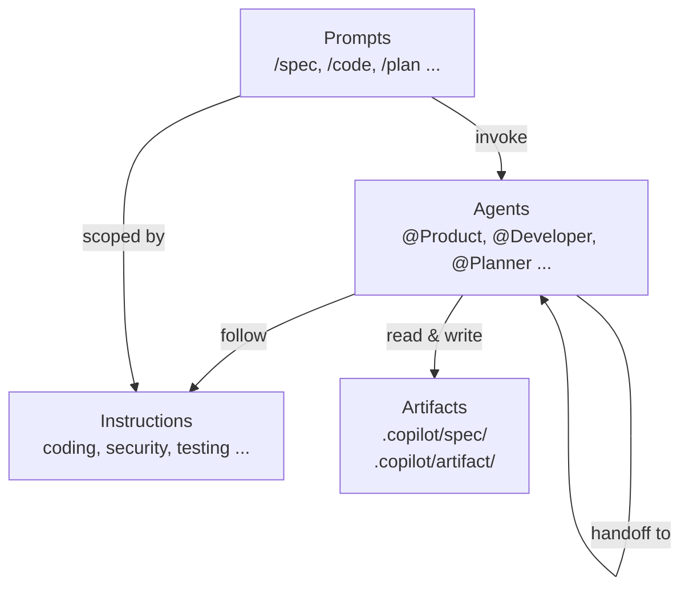

# GitHub Copilot Custom Setup

This folder contains the complete GitHub Copilot customization for this project — instructions, agents, and prompts — designed to be **reusable across any repository** in the organization.

> **New here?** Read [CONTRIBUTING.md](CONTRIBUTING.md) to add agents, instructions, prompts, or skills.  
> **Model choices?** See [MODEL_STRATEGY.md](MODEL_STRATEGY.md).  
> **What changed?** See [CHANGELOG.md](CHANGELOG.md).

---

## Installation

Install via **npm** (no prior install required — works with `npx`):

```bash
# Run once per machine — installs globally into VS Code and the current repo
npx copilot-skills-kit install

# Install into a specific repository
npx copilot-skills-kit install --target ~/projects/my-app

# Install globally only (skip per-repo .github/ copy)
npx copilot-skills-kit install --global-only
```

Or install via **pip**:

```bash
pip install copilot-skills-kit
copilot-skills-kit install
```

Both commands do the same thing:

1. Copy all agents, prompts, and instructions to VS Code's global user prompts directory.
2. Copy the full framework into `.github/` of the target repository.
3. Create `.vscode/settings.json` if one does not already exist.

---

## Philosophy

| Concept | What it is | Analogy |
|---------|-----------|---------|
| **Instructions** | Coding standards and rules, auto-applied by file type | The team's style guide |
| **Agents** | Persistent AI personas with specific tools and capabilities | Team members (roles) |
| **Prompts** | Reusable tasks that invoke an agent with a specific brief | Work orders |

> **Agents are personas. Prompts are tasks. One persona can do many tasks.**

---

## Folder Structure

```
.github/
├── instructions/          # Auto-applied rules (by file glob)
│   ├── copilot.instructions.md          # Global Copilot behavior
│   ├── architecture.instructions.md     # System design principles
│   ├── coding.standard.instructions.md  # Universal coding rules
│   ├── coding.python.instructions.md    # Python-specific (PEP 8, type hints, pytest)
│   ├── coding.javascript.instructions.md# JS/TS-specific (ES6+, strict TS, eslint)
│   ├── coding.go.instructions.md        # Go-specific (gofmt, modules, golangci-lint)
│   ├── coding.sql.instructions.md       # SQL conventions
│   ├── coding.terraform.instructions.md # Terraform/IaC patterns
│   ├── testing.instructions.md          # Test organization and coverage
│   ├── security.instructions.md         # Security standards
│   ├── observability.instructions.md    # Logging, tracing, RED/USE metrics
│   ├── quality.instructions.md          # Static analysis thresholds
│   ├── devops.instructions.md           # CI/CD and deployment
│   ├── docker.instructions.md           # Dockerfile best practices
│   ├── ui.instructions.md               # Frontend and accessibility
│   ├── documentation.instructions.md    # Doc structure (README, ADR, API docs)
│   └── review.instructions.md           # Code review process
│
├── agents/                # AI personas (who + how)
│   ├── Product.agent.md        # Product Owner — writes specs
│   ├── Researcher.agent.md     # Technology Researcher — evaluates options (ToT)
│   ├── Planner.agent.md        # Technical Lead — creates plans (tasks)
│   └── Developer.agent.md      # Senior Developer — implements + unit tests
│
├── prompts/               # Reusable tasks (what)
│   ├── spec.prompt.md          # /spec — write a feature or bug specification
│   ├── research.prompt.md      # /research — evaluate tech options (ToT)
│   ├── plan.prompt.md          # /plan — create an implementation plan
│   ├── code.prompt.md          # /code — implement with unit tests
│   ├── quickfix.prompt.md      # /quickfix — trivial plan+code+test in one step
│   ├── registry.prompt.md      # /registry — generate spec index/catalogue
│   ├── status.prompt.md        # /status — dashboard view of a spec's progress
│   └── resume.prompt.md        # /resume — recover interrupted sessions
│
└── README.md              # ← You are here
```

---

## Instructions (Auto-Applied Rules)

Instructions are **automatically applied** based on the file you're editing. You never need to invoke them manually.

| Instruction | Applied To | Purpose |
|-------------|-----------|---------|
| `copilot` | `**` (all files) | Copilot behavior: concise, absolute paths, PowerShell conventions |
| `architecture` | `**/*.{py,go,ts,js,jsx,tsx,sql,tf,yaml,yml,json,md}` | Separation of concerns, API design, module structure |
| `coding.standard` | `**` | Naming, functions, error handling, DRY, commits |
| `coding.javascript` | `**/*.{js,jsx,mjs,cjs}` | ES6+, strict mode, eslint/prettier |
| `coding.typescript` | `**/*.{ts,tsx}` | Strict mode, generic constraints, branded types, union types |
| `coding.python` | `**/*.{py,pyi}` | PEP 8, type hints, pytest, ruff/mypy |
| `coding.go` | `**/*.go` | Effective Go, modules, golangci-lint, race detection |
| `coding.rust` | `**/*.rs` | Ownership, error handling (`?`), tokio concurrency |
| `coding.java` | `**/*.java` | Immutability, Optional, modern features (records, var) |
| `coding.sql` | `**/*.{sql}` | SQL conventions, parameterized queries, migrations |
| `coding.terraform` | `**/*.{tf,tfvars,hcl}` | Terraform modules, state management, providers |
| `api-versioning` | `**/*.{ts,js,py,go,java,rs,yaml,yml,json}` | URI versioning, deprecation headers, Sunset policy, breaking changes |
| `testing` | `**` | AAA pattern, test/unit/ + test/integration/ + test/contract/ |
| `security` | `**` | Auth, secrets, input/output, OWASP, dependency scanning |
| `observability` | `**/*.{py,go,ts,js,java,cs}` | Structured JSON logging, RED/USE metrics, tracing |
| `quality` | `**/*.{py,ts,js,jsx,tsx,sql,tf}` | Static analysis, code smells, complexity thresholds |
| `devops` | `**/*.{yaml,yml,tf,sh,cmd,ps1,Dockerfile}` | CI/CD pipeline stages, containerization |
| `docker` | `**/Dockerfile*,**/docker-compose*.{yml,yaml}` | Multi-stage, slim bases, non-root, health checks |
| `ui` | `**/*.{html,css,scss,less,js,ts,jsx,tsx,vue,svelte}` | Accessibility, responsive, Material Design |
| `documentation` | `**/*.{md,mdx,rst,txt,adoc}` | README structure, API docs, ADRs, changelog |
| `review` | `**` | PR guidelines, review checklist, feedback tone |

### How instructions work

Each instruction file has YAML frontmatter with an `applyTo` glob pattern. When you edit a file matching that pattern, the instruction is automatically included in the AI's context. No action needed.

```yaml
---
applyTo: "**/*.{py,pyi}"
---
Follow PEP 8. Use type hints everywhere. Prefer pytest for testing.
```

---

## Agents (AI Personas)

Agents are **persistent AI personas** you switch to with `@AgentName`. Each agent has its own tools, instruction references, handoffs, and output paths.

| Agent | Persona | Model | Key Tools | Writes To |
|-------|---------|-------|-----------|-----------|
| `@Product` | Product Owner | Claude Opus 4.6 | agent, edit, read, web, vscode/askQuestions | `.copilot/spec/` |
| `@Researcher` | Technology Researcher | Claude Opus 4.6 | agent, edit, search, read, web/fetch, vscode/askQuestions | `.copilot/artifact/<spec_id>/research/` |
| `@Planner` | Technical Lead | Claude Sonnet 4.6 | agent, edit, search, read, execute, vscode/askQuestions | `.copilot/artifact/<spec_id>/plan/` |
| `@Developer` | Senior Developer | Claude Sonnet 4.6 | agent, edit, search, read, execute, web, vscode/askQuestions | `src/` + `test/unit/` |

### Handoff Flow

```
┌──────────┐     ┌────────────┐     ┌─────────┐     ┌───────────┐
│ Product  │────▶│ Researcher │────▶│ Planner │────▶│ Developer │
│          │     │ (optional) │     │         │     │           │
└────┬─────┘     └─────┬──────┘     └────┬────┘     └─────┬─────┘
     │                 │                 │                │
  🔒 Gate:          🔒 Gate:          🔒 Gate:           🔒 Gate:
  (none)            spec=approved    spec=approved     spec=approved
                                    +research=         +plan exists
                                      approved
  📝 Output:       📝 Output:         📝 Output:        📝 Output:
  spec/            research/          plan/             src/ +
                   +constraints.md                       test/unit/
  🔄 Approval:     🔄 Approval:       🔄 Approval:      🔄 Self-verify:
  Approve /        Approve /          User reviews      tests + lint
  Request Changes  Request Changes      plan
```

**Key mechanics:**

- **Handoff buttons** appear in chat after each agent completes. Click to proceed to the next agent.
- **Approval gates** (Product, Researcher) ask explicit Approve/Request Changes via `askQuestions`. Handoff buttons shown only after approval.
- **Pre-condition gates** — each agent verifies upstream artifacts are approved before starting work.
- **Data contracts** — Researcher's `recommendation.md` is treated as **binding constraints** by downstream agents (not re-evaluated).
- **Developer writes unit tests** alongside implementation — no separate testing agent needed.

---

## Prompts (Tasks)

Prompts are **slash commands** you invoke in chat. Each prompt delegates to a custom agent and takes a `spec_id` as input.

### How `spec_id` input works

Every prompt uses the VS Code `${input:spec_id}` variable. When you run a prompt, **VS Code shows an input dialog** asking for the spec_id value. You can also type additional context after the slash command.

**Usage:**

```
/spec                    → VS Code prompts: "Feature name e.g. user-auth"
                           You type: user-auth
                           Additional context in chat: "JWT-based authentication with refresh tokens"

/code                    → VS Code prompts: "Spec ID e.g. user-auth"
                           You type: user-auth
                           Additional context in chat: "Focus on the login endpoint first"
```

The `spec_id` is the **thread** that connects all artifacts. Use the same value across all tasks for one feature/bug.

### Prompt Reference

| Prompt | Agent | Model | What it does |
|--------|-------|-------|-------------|
| `/spec` | Product | Claude Opus 4.6 | Write a feature or bug specification (asks which type) |
| `/research` | Researcher | Claude Opus 4.6 | Evaluate tech options (ToT), build preferences, produce DB model |
| `/plan` | Planner | Claude Sonnet 4.6 | Create implementation plan |
| `/code` | Developer | Claude Sonnet 4.6 | Implement with unit tests |
| `/quickfix` | Developer | Claude Sonnet 4.6 | Trivial plan+code+test in one step (<50 LOC) |
| `/registry` | Product | GPT-4.1 | Generate/update spec index at `.copilot/spec/REGISTRY.md` |
| `/status` | Product | Claude Opus 4.6 | Dashboard view of a spec's progress and artifacts |
| `/resume` | Product | Claude Opus 4.6 | Recover interrupted sessions and find the next logical step |
### Model Strategy

Model assignments are maintained in **[MODEL_STRATEGY.md](MODEL_STRATEGY.md)** to avoid stale references here. That document covers model-to-prompt/agent mapping, selection principles, and how to update models when they change.

---

## Artifacts (`.copilot/` Folder)

All AI-generated documents are stored in `.copilot/`, organized by type and spec_id.

```
.copilot/
├── context/                               # Project context (human-maintained)
│   ├── overview.md                        # Project name, overview, users, capabilities
│   └── constraints.md                     # Team tech preferences (built by Researcher)
├── spec/                                  # Flat catalogue of all specs
│   ├── REGISTRY.md                        # Auto-generated spec index (/registry)
│   ├── user-auth.md                       # Feature spec (Product)
│   ├── BUG-1234.md                        # Bug spec (Product)
│   └── dashboard-redesign.md
│
    └── artifact/
    ├── user-auth/                         # Per-spec artifacts
    │   ├── research/                      # Tech evaluation (Researcher)
    │   │   ├── compute-platform.md        # ToT: GKE vs Cloud Run vs ...
    │   │   ├── database-model.md          # Conceptual ERD, entities, indexes
    │   │   └── recommendation.md          # Summary of all decisions
    │   └── plan/                          # Implementation plan (Planner)
    │       └── user-auth.md
    │
    └── BUG-1234/
        └── plan/
```

### Why this structure?

- **Specs are flat** — they're a shared catalogue across the project, not nested per-feature.
- **Context is human-maintained** — `overview.md` gives agents project context; `constraints.md` is built by the Researcher as tech decisions are made.
- **Artifacts are grouped by spec_id** — everything related to one feature/bug lives together.
- **Research is optional** — the Researcher evaluates tech options and builds preferences over time. Run `/research` before `/plan` when technology decisions are needed.
- **Preferences grow over time** — `.copilot/context/constraints.md` is organized into layers (Infrastructure, Backend, Frontend, Data, Observability, Security, Testing) with a Quick Reference table and Decision Log. Starts empty, populated incrementally by the Researcher as the team makes decisions across features.
- **REGISTRY.md** — auto-generated index of all specs with status, type, and artifact links. Run `/registry` to update.

### Spec Metadata (Frontmatter)

Every spec includes YAML frontmatter for workflow control:

```yaml
---
spec_id: user-auth
type: feature              # feature | bugfix | refactor | infra | ui-only
status: draft              # draft → approved → in-progress → done
approved_by:               # Human fills this on approval
approved_date:             # Date of approval
---
```

- **`status`** drives gate checks: Planner won't plan unless spec is `approved`, Developer won't code unless plan exists.
- **`type`** is informational — classifies the work for the registry.
- The **Changelog** section at the bottom of each spec tracks in-document changes alongside Git history.

---

## Framework Architecture

The diagram below shows how the four artifact types relate to each other at runtime.



| Layer | Lives in | Applied by |
|-------|----------|------------|
| **Instructions** | `instructions/` | VS Code automatically, based on `applyTo` glob |
| **Agents** | `agents/` | You switch with `@AgentName` or a prompt delegates |
| **Prompts** | `prompts/` | You invoke with `/command` |
| **Artifacts** | `.copilot/` | Agents read and write; humans approve |

---

## Typical Workflow

There are **two ways** to drive the workflow: **handoff-driven** (recommended) and **prompt-driven** (ad-hoc).

### Mode 1: Handoff-Driven (Recommended for Features)

You type **one prompt** to start, then follow handoff buttons through the chain. Each agent asks for explicit **Approve / Request Changes** before proceeding.

**Human inputs: 1 typed prompt + approval decisions + tech preference answers + handoff clicks.**

### Mode 2: Prompt-Driven (Ad-Hoc / Re-Runs)

Use standalone prompts to enter mid-flow, re-run a stage, or work across sessions:

```
/spec user-auth         → Start from scratch
/research user-auth     → Evaluate tech options (builds preferences over time)
/plan user-auth         → Re-run planning
/code user-auth         → Re-run just implementation
/quickfix fix-typo      → Trivial combined plan+code+test
/registry               → Update the spec index
```

---

## End-to-End Flow (Detailed)

This section shows **exactly** what happens at each step — what the human does, what the agent does, what artifacts are produced, and what gates are enforced.

### Step 1: Specification — `@Product` via `/spec`

| | Detail |
|---|---|
| **You type** | `/spec user-auth` + optional context: *"JWT-based auth with refresh tokens"* |
| **VS Code shows** | Input dialog: *"Spec ID e.g. user-auth or BUG-1234"* → you enter `user-auth` |
| **Model** | Claude Opus 4.6 |
| **Pre-condition** | None (first step) |

> **Rule: 1 file = 1 story/bug.** A single spec file never contains multiple stories. If the input is too broad, the agent asks whether to split.

**Agent workflow:**

```
1. 🤖 Reads .copilot/context/overview.md for project context
2. 🤖 Asks: "Feature or Bug?" (askQuestions: Feature / Bug)
3. 👤 You answer: "Feature"
4. 🤖 Asks clarifying questions about requirements (one at a time)
5. 👤 You answer each question
6. 🤖 SCOPE CHECK — evaluates whether the input is a single focused story or broader:
   If single story → proceeds to write one spec file.
   If broader (epic-sized scope):
   ┌──────────────────────────────────────────────────────────────────┐
   │ 🤖 Asks: "This could be split into 3 stories:                    │
   │     1. user-auth-001 — JWT token issuance                        │
   │     2. user-auth-002 — Refresh token rotation                    │
   │     3. user-auth-003 — Session management                        │
   │    Split into separate specs, or keep as one?"                   │
   │                                                                  │
   │ 👤 You choose: "Split" or "Keep as one"                          │
   │                                                                  │
   │ If Split:                                                        │
   │   → Creates each story as a separate file, ONE AT A TIME:        │
   │     .copilot/spec/user-auth-001.md → draft → approve             │
   │     .copilot/spec/user-auth-002.md → draft → approve             │
   │     .copilot/spec/user-auth-003.md → draft → approve             │
   │   → Handoff buttons shown after ALL stories are approved.        │
   └──────────────────────────────────────────────────────────────────┘

7. 🤖 Writes spec draft to .copilot/spec/user-auth.md (or user-auth-001.md if split)
      Frontmatter: spec_id: user-auth, type: feature, status: draft
      Content: overview, goals, user stories, functional/non-functional requirements,
               acceptance criteria, out of scope, success metrics, changelog
8. 🤖 Asks: "Approve or Request Changes?" (askQuestions)
9.    ↕ If Request Changes → you explain what to change → agent iterates → asks again
10. 👤 You select: "Approve"
11. 🤖 Updates frontmatter: status: approved, approved_by: human, approved_date: 2026-02-23
12.    If split and more stories remain → proceeds to next story (back to step 7)
       If all done → shows handoff buttons:
       [Research Technical Options] [Plan Implementation]
```

**Artifacts produced:**

| Scenario | Files |
|----------|-------|
| Single story | `.copilot/spec/user-auth.md` |
| Split (3 stories) | `.copilot/spec/user-auth-001.md`, `user-auth-002.md`, `user-auth-003.md` |

---

### Step 2: Research — `@Researcher` via `/research` or handoff

| | Detail |
|---|---|
| **You do** | Click `[Research Technical Options]` handoff **or** type `/research user-auth` |
| **Model** | Claude Opus 4.6 |
| **Pre-condition** | Spec `status: approved` ← verified automatically; **stops with warning** if not met |

**Agent workflow:**

```
1. 🤖 Gate check: reads .copilot/spec/user-auth.md → verifies status: approved ✓
2. 🤖 Reads .copilot/context/constraints.md for existing team preferences
3. 🤖 Reads .copilot/context/overview.md for project context
4. 🤖 Identifies technology decisions needed from the spec
   (e.g., database, compute platform, auth provider, message broker)

5. 🤖 PREFERENCE DISCOVERY (one question at a time, per category):
   ──────────────────────────────────────────────────────────
   🤖 "For the Backend layer — what database do you prefer?"
      Options: PostgreSQL / MySQL / MongoDB / Evaluate options for me
   👤 You answer: "PostgreSQL"
   🤖 Records preference → moves to next decision

   🤖 "For the Infrastructure layer — compute platform?"
      Options: GKE / Cloud Run / Cloud Functions / Evaluate options for me
   👤 You answer: "Evaluate options for me"

6. 🤖 TREE-OF-THOUGHT ANALYSIS (when you say "Evaluate"):
   ──────────────────────────────────────────────────────────
   🤖 Evaluates 3–5 options with weighted comparison matrix:
      ┌──────────────┬───────────┬──────────┬──────────┬───────┐
      │ Criterion    │ Weight    │ GKE      │ CloudRun │ CF    │
      ├──────────────┼───────────┼──────────┼──────────┼───────┤
      │ Scalability  │ 30%       │ 9        │ 8        │ 6     │
      │ Cost         │ 25%       │ 5        │ 8        │ 9     │
      │ Complexity   │ 20%       │ 4        │ 8        │ 9     │
      │ ...          │ ...       │ ...      │ ...      │ ...   │
      ├──────────────┼───────────┼──────────┼──────────┼───────┤
      │ TOTAL        │ 100%      │ 6.2      │ 7.8      │ 7.1   │
      └──────────────┴───────────┴──────────┴──────────┴───────┘
   🤖 Presents comparison + recommendation
   👤 You choose: "Cloud Run"

7. 🤖 DATABASE MODELING (if spec involves data persistence):
   ──────────────────────────────────────────────────────────
   🤖 Produces conceptual ERD: entities, relationships, key attributes, indexes

8. 🤖 Writes all research artifacts
9. 🤖 Updates .copilot/context/constraints.md with new decisions
10. 🤖 Asks: "Approve or Request Changes?" (askQuestions)
11.   ↕ If Request Changes → iterate → ask again
12. 👤 You select: "Approve"
13. 🤖 Updates recommendation.md: Status: Approved
14. 🤖 Shows handoff button: [Plan Implementation]
```

**Artifacts produced:**

| File | Content |
|------|---------|
| `.copilot/artifact/user-auth/research/compute-platform.md` | ToT analysis: options, weighted matrix, recommendation |
| `.copilot/artifact/user-auth/research/database-model.md` | Conceptual ERD, entities, relationships, indexes |
| `.copilot/artifact/user-auth/research/recommendation.md` | **Binding decisions** — Chosen Technology Stack table + Constraints for downstream agents |
| `.copilot/context/constraints.md` | Updated with new Quick Reference entries + Decision Log |

> **Key:** `recommendation.md` includes a **Chosen Technology Stack** table and **Constraints for Downstream Agents** section that the Planner and Developer treat as binding (not re-evaluated).

---

### Step 3: Planning — `@Planner` via `/plan` or handoff

| | Detail |
|---|---|
| **You do** | Click `[Plan Implementation]` handoff **or** type `/plan user-auth` |
| **Model** | Claude Sonnet 4.6 |
| **Pre-condition** | Spec `status: approved` **AND** research approved (if research exists) |

**Agent workflow:**

```
1. 🤖 Gate check: reads spec → status: approved ✓
   🤖 Gate check: reads research → Status: Approved ✓ (if exists)
2. 🤖 Reads ALL inputs:
   ├── .copilot/spec/user-auth.md                (spec)
   ├── .copilot/artifact/user-auth/research/      (research — if exists)
   └── existing codebase                          (discovers patterns, structure, deps)

3. 🤖 Uses a sub-agent to deeply research the codebase (no plan yet)
4. 🤖 May ask clarifying questions via askQuestions
5. 👤 You answer if asked

6. 🤖 PLAN DESIGN (NO code blocks — describes changes only):
   ──────────────────────────────────────────────────────────
   - Ordered task breakdown with dependencies
   - File and symbol references (what to create/modify)
   - Unit test expectations per task
   - Estimated complexity per task
   - Cross-references to spec sections + research decisions

7. 🤖 Writes plan
8. 🤖 Presents plan for review
9. 👤 You review, provide feedback or click [Start Implementation]
```

**Artifacts produced:**

| File | Content |
|------|---------|
| `.copilot/artifact/user-auth/plan/user-auth.md` | Ordered task list with file refs, test expectations, no code blocks |

---

### Step 4: Implementation — `@Developer` via `/code` or handoff

| | Detail |
|---|---|
| **You do** | Click `[Start Implementation]` handoff **or** type `/code user-auth` |
| **Model** | Claude Sonnet 4.6 |
| **Pre-condition** | Spec `status: approved` **AND** plan exists in `.copilot/artifact/<spec_id>/plan/` |

**Agent workflow:**

```
1. 🤖 Gate check: reads spec → status: approved ✓
   🤖 Gate check: plan exists ✓

2. 🤖 Reads ALL inputs:
   ├── .copilot/artifact/user-auth/plan/user-auth.md  (plan — followed step by step)
   ├── .copilot/spec/user-auth.md                      (spec — for requirement context)
   ├── .copilot/artifact/user-auth/research/            (research — if exists)
   └── existing codebase                                (patterns, conventions)

3. 🤖 IMPLEMENT (follows plan tasks in order):
   ──────────────────────────────────────────────────────────
   For each plan task:
   a. Create/modify source files in src/
   b. Write unit tests in test/unit/
   c. Run tests + linters → fix if failing
   d. Move to next task

4. 🤖 SPEC FEEDBACK LOOP:
   If spec is incomplete/contradictory → STOPS and flags to human
   Does NOT silently work around spec gaps

5. 🤖 Self-verify: runs all unit tests + linter checks
6. 🤖 Presents summary: files changed, tests written, pass/fail, deviations from plan
```

**Artifacts produced:**

| Location | Content |
|----------|---------|
| `src/` | Production source code following plan |
| `test/unit/` | Unit tests (AAA pattern, ≥80% coverage target) |

---

### Complete Artifact Map (After Full Flow)

After running all 4 steps, the file tree looks like:

```
.copilot/
├── context/
│   ├── overview.md                              # Unchanged (human-maintained)
│   └── constraints.md                           # Updated by Researcher with new decisions
├── spec/
│   └── user-auth.md                             # status: approved (Step 1)
│
└── artifact/user-auth/
    ├── research/                                 # Step 2
    │   ├── compute-platform.md                   #   ToT analysis
    │   ├── database-model.md                     #   Conceptual ERD
    │   └── recommendation.md                     #   Binding decisions (Status: Approved)
    └── plan/                                     # Step 3
        └── user-auth.md                          #   Task breakdown

src/         ← Production code (Step 4)
test/unit/   ← Unit tests (Step 4)
```

---

### Workflow Variants

#### Quick bug fix (skip research)

```
1. /spec BUG-1234         → 🤖 Product asks "Feature or Bug?" → you say Bug
                             🤖 Writes bug spec: steps to reproduce, expected vs actual,
                                severity, root cause hypothesis
                             👤 Approve
2. /plan BUG-1234         → 🤖 Planner reads spec, writes fix plan
                             👤 Review, click [Start Implementation]
3. /code BUG-1234         → 🤖 Developer implements fix + unit tests + runs tests ✅
```

#### Trivial fix (quickfix shortcut)

```
1. /quickfix fix-typo     → 🤖 Developer checks: <50 LOC? No new API? No arch decisions?
                             ✓ Qualifies → inline plan + implement + test in one shot
                             ✗ Too complex → STOPS, suggests full /spec → /plan → /code flow
```

#### Registry update (index all specs)

```
/registry               → 🤖 Product scans all .copilot/spec/*.md
                            Reads frontmatter from each
                            Checks which artifacts exist (research, plan)
                            📝 Writes .copilot/spec/REGISTRY.md (summary + full table)
```

---

## Gate Summary

| Agent | Pre-Condition Gate (Step 0) | Approval Gate | What Blocks |
|-------|---------------------------|---------------|-------------|
| `@Product` | — | Approve / Request Changes | Handoff buttons hidden until approved |
| `@Researcher` | Spec `status: approved` | Approve / Request Changes | Handoff buttons hidden until approved |
| `@Planner` | Spec `status: approved` + research approved (if exists) | User reviews plan | Handoff to Developer |
| `@Developer` | Spec `status: approved` + plan exists | Self-verify (tests + lint) | — |

---

## Spec-Driven Development Alignment

This setup follows **Spec-Driven Development (SDD)** principles:

| SDD Principle | How We Implement It |
|---------------|-------------------|
| Spec before code | `/spec` → `/code` flow enforced; gate checks verify `status: approved` |
| Technology evaluation | `/research` uses Tree-of-Thought analysis; preferences built incrementally via user questions |
| Database modeling | Researcher produces conceptual ERD with entities, relationships, and indexes |
| Artifact traceability | `spec_id` threads all artifacts: spec → research → plan → code → tests |
| Approval gates | Product and Researcher ask explicit Approve/Request Changes via `askQuestions`; handoff buttons shown only after approval |
| Pre-condition gates | Each agent checks upstream artifact status before starting work |
| Binding research decisions | Researcher's `recommendation.md` is treated as binding constraints by Planner and Developer — not re-evaluated |
| Feedback loop | Developer flags spec gaps during implementation instead of silently working around them |
| Spec catalogue | `/registry` prompt generates an index of all specs with status and linked artifacts |
| Preference management | `.copilot/context/constraints.md` organized by layers (Infra, Backend, Frontend, Data, etc.) with Quick Reference table and Decision Log |

---


## Adopting in Other Repos

1. **Copy the `.github/` folder** into your repo.
2. **Copy the `.copilot/context/` folder** — update `overview.md` with your project details; clear `constraints.md`.
3. **Adjust instruction globs** if your project structure differs (e.g., different source folders).
4. **Update `impl/` references** in agent files if your project uses a different source root.

---

## Troubleshooting

- **Prompts not showing?** — Type `/` in chat. If missing, check `chat.promptFilesLocations` in settings.
- **Agent not found?** — Type `@` in chat. Check **Configure Chat > Diagnostics** for errors.
- **Instructions not applied?** — Check the `applyTo` glob matches your file. Use **Configure Chat > Diagnostics**.
- **Wrong model?** — The prompt's `model:` overrides the model picker. The agent's `model:` is used when invoking the agent directly (without a prompt).
- **Input dialog not appearing?** — Ensure your VS Code version supports `${input:variableName}` in prompt files.
- **Gate check failing?** — Verify the upstream artifact exists and has the correct `status` in its YAML frontmatter.


---


---


